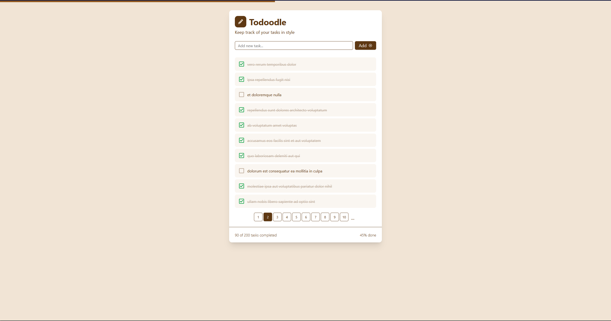

# 📝 Todoodle

### Keep track of your tasks in style! 🚀

<p align="center">
  <a href="https://todoodle.vercel.app" target="_blank"></a>
</p>

---

## 📌 About Todoodle

Todoodle is a sleek, intuitive, and highly efficient task planner designed to make organizing your life effortless and fun! Whether you're managing daily to-dos, tracking project progress, or setting reminders, Todoodle has got you covered.

### ✨ Features

- ✅ **Task Management** – Create, edit, and delete tasks with ease.
- 📊 **Progress Tracking** – View your task completion trends.
- **🔍 SEO Optimized** – Built-in SEO enhancements using **Next.js**.
- 🎨 **Beautiful UI** – A modern, user-friendly design.
- 🌐 **Cross-Platform** – Accessible from any device.

---

## 🚀 Getting Started

### 🛠 Installation

1️⃣ Clone the repository and install dependencies:

```sh
# Clone the repo
git clone https://github.com/EcchiGrill/todoodle.git
cd todoodle

# Install dependencies
yarn install  # or npm install
```

2️⃣ Configure Environment Variables

Create a **.env** file in the **todoodle/** directory and add variables mentioned in **.env.example**

### 💻 Running the App

Start the development server:

```sh
yarn dev  # or npm run dev
```

The app will be available at `http://localhost:3000`.

---

## 📦 Tech Stack

- 🔵 **TailwindCSS**
- 🟢 **Next.js**
- 🔴 **[JSON Placeholder](https://jsonplaceholder.typicode.com/)** - for fake API requests

---

## 📜 License

This project is licensed under the [MIT License](LICENSE).
